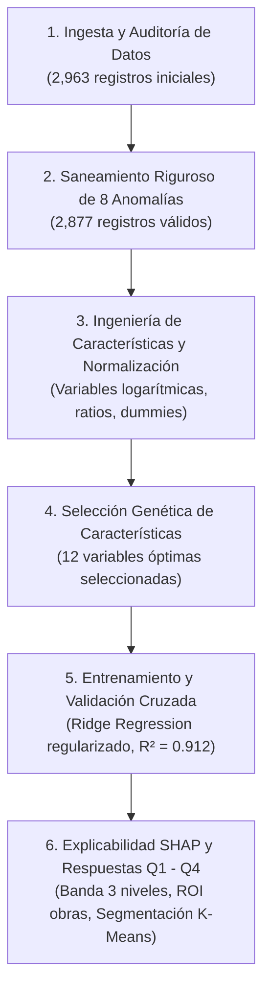

# Evaluación Técnica Data Scientist — Caso Clearview Properties
**Cuesta Partners · Take-home Assessment**  
**Candidato:** Daniel Alejandro Córdoba Pulido  
**Fecha de Entrega:** 27 de Agosto de 2026  

---

[Version Ingles](https://github.com/danielcordobap/cuesta_partners_eng)

## 📌 1. Descripción del Proyecto

Este repositorio contiene la solución técnica y estratégica desarrollada para la prueba de ingreso a **Cuesta Partners**, enfocada en el caso de negocio de la agencia inmobiliaria **Clearview Properties** en Cedar Falls, Iowa.

El objetivo central es transformar un histórico de **2,963 transacciones residenciales** en herramientas analíticas y comerciales de precisión que:
1. Respalden el criterio de cotización de los brókers con un rango probabilístico fundamentado.
2. Identifiquen y cuantifiquen en dólares el impacto de las variables estructurales vs. modificables.
3. Prioricen inversiones en remodelaciones con alto retorno sobre el costo de obra (*ROI*).
4. Segmenten el mercado e identifiquen oportunidades concretas de reposicionamiento y valorización rápida.

---

## 🗂️ 2. Estructura del Repositorio

```text
├── EDA_Test_cuesta.ipynb                                   # Notebook principal con todo el pipeline de Data Science
├── function_utils.py                                       # Módulo modularizado de funciones analíticas y visuales
├── Presentacion_Ejecutiva_Clearview_Properties_Cuesta.pptx # Presentación de negocio para Dirección General (12 slides)
├── Brief_Candidate_DataScientist.pdf                       # Brief oficial y requerimientos de la prueba
├── data_cedar_falls.zip                                    # Dataset original comprimido (Data.csv y Data_Dictionary.txt)
├── assets_presentacion/                                    # Gráficos en alta resolución embebidos en el deck ejecutivo
│   ├── fig_q1_banda.png                                   # Visualización de la banda de cotización en 3 niveles
│   ├── fig_q2_drivers.png                                 # Descomposición Chasis Estructural (60%) vs Modificables (40%)
│   ├── fig_q3_matriz.png                                  # Matriz de retorno financiero vs. costo estimado de obra
│   ├── fig_q4_arbitraje.png                               # Segmentación de mercado y salto de valor por pavimentación
│   └── logo_cuesta.png                                    # Identidad corporativa de Cuesta Partners
├── requirements.txt                                        # Dependencias exactas para instalación con pip
├── .gitignore                                              # Exclusiones de archivos temporales y entornos
└── README.md                                               # Documentación ejecutiva, técnica y guía de reproducción
```

---

## ⚙️ 3. Requisitos y Guía de Reproducción

### Requisitos del Sistema
* **Python:** Versión `3.10`, `3.11` o `3.12` recomendada.
* **Jupyter Lab / Notebook:** Para la ejecución interactiva del código.

### Paso a Paso para la Ejecución

1. **Clonar o descargar el repositorio:**
   ```bash
   git clone <URL_DEL_REPOSITORIO>
   cd prueba_cuesta_repo
   ```

2. **Crear y activar un entorno virtual:**
   ```bash
   # En Windows
   python -m venv .venv
   .venv\Scripts\activate

   # En Linux / macOS
   python3 -m venv .venv
   source .venv/bin/activate
   ```

3. **Instalar dependencias:**
   ```bash
   pip install -r requirements.txt
   ```

4. **Descomprimir el dataset:**
   ```bash
   # Opción 1: En terminal (Windows / Linux / macOS)
   tar -xf data_cedar_falls.zip

   # Opción 2: En Python
   python -c "import zipfile; zipfile.ZipFile('data_cedar_falls.zip').extractall('.')"
   ```
   *(Esto extraerá `Data.csv` y `Data_Dictionary.txt` directamente en la raíz del proyecto).*

5. **Lanzar Jupyter Lab y ejecutar el Notebook:**
   ```bash
   jupyter lab
   ```
   Abrir [`EDA_Test_cuesta.ipynb`](EDA_Test_cuesta.ipynb) y ejecutar todas las celdas secuencialmente (*Run All Cells*).

---

## 🔬 4. Arquitectura del Flujo Analítico (`EDA_Test_cuesta.ipynb`)

El notebook sigue un diseño modular y reproducible apoyado en [`function_utils.py`](function_utils.py):



### Principales Etapas Analíticas:
1. **Auditoría y Saneamiento de Datos:**
   * Detección y corrección de 8 anomalías críticas no documentadas: corrección de precios centinela (`$9,999,999` y ceros de captura), corrección de signos negativos, remoción de duplicados operativos, corrección de inconsistencias cronológicas de remodelación y tratamiento formal de nulos estructurales (propiedades sin garaje o sin sótano).
2. **Selección Genética de Variables:**
   * Algoritmo Genético multiobjetivo que reduce de más de 80 columnas a **12 variables clave de alto poder explicativo**, maximizando $R^2$ sin multicolinealidad.
3. **Modelado y Validación:**
   * Modelo lineal regularizado (**Ridge Regression**) sobre variables transformadas logarítmicamente.
   * **Métricas en conjunto de test (576 propiedades no vistas):** $R^2 = 0.912$, $	ext{MAPE} = 9.4\%$, $	ext{MAE} = \$16,500$.
4. **Explicabilidad en Términos de Negocio (SHAP):**
   * Descomposición del precio en variables de *Chasis Estructural* ($pprox 60\%$) y *Características Modificables* ($pprox 40\%$).

---

## 📊 5. Respuestas Ejecutivas a las Preguntas de Negocio

| Pregunta del Brief | Hallazgo Analítico Central | Estrategia Comercial para Clearview Properties |
| :--- | :--- | :--- |
| **Q1 · Rango de Listado** | Los residuos empíricos definen una banda de **$80\%$ de cobertura real de mercado**: **$P_{10} = -13.6\%$** (Piso) y **$P_{90} = +16.3\%$** (Techo). | **Estrategia de 3 Niveles:** Presentar al bróker un Techo de Salida ($+16.3\%$), un Precio Central Justo ($100\%$) y un Piso de Negociación ($-13.6\%$) para cierres rápidos o límite de contraoferta. |
| **Q2 · Drivers de Valor** | El **$60\%$** del precio lo explica el *Chasis Estructural* (`Overall Qual`, `Gr Liv Area`, `Total Bsmt SF`, `Year Built`, `Garage Cars`). El **$40\%$** restante corresponde a *Características Modificables*. | Concentrar la asesoría comercial con el vendedor en las variables modificables que incrementan la valorización final (baños, cocina, acabados de garaje, pavimento). |
| **Q3 · ROI de Mejoras** | **Quick Wins de Alto Retorno:** Baño completo adicional ($+\$9,688$), pavimentación vehicular ($+\$5,273$), terminación interior de garaje ($+\$3,025$). | Recomendar prioritariamente obras de bajo costo y alto retorno. **Desaconsejar** construir chimeneas desde cero (costo de obra civil > ganancia de $+\$11,340$). |
| **Q4 · Segmentación y Oportunidad** | El análisis PCA + K-Means ($K=3$) identifica 3 segmentos: **Alto** ($\$237.6	ext{k}$), **Medio** ($\$136.9	ext{k}$) y **Entrada** ($\$112.5	ext{k}$). El **$0\%$** de las casas de Entrada tiene pavimento. | **Oportunidad de Reposicionamiento:** Invertir $pprox \$3,000$ en pavimentar la entrada en el segmento Entrada desbloquea un salto de **$+\$24,400$** hacia el segmento Medio. |

---

## 📑 6. Entregables Oficiales

1. 💻 **Notebook Técnico Reproducible:** [`EDA_Test_cuesta.ipynb`](EDA_Test_cuesta.ipynb)
2. 📊 **Presentación Ejecutiva para el Cliente:** [`Presentacion_Ejecutiva_Clearview_Properties_Cuesta.pptx`](Presentacion_Ejecutiva_Clearview_Properties_Cuesta.pptx) *(12 diapositivas, formato 16:9, identidad visual de Cuesta Partners y citas directas a fuentes oficiales de la industria [costvsvalue.com](https://www.costvsvalue.com) y [nahb.org](https://www.nahb.org))*.
