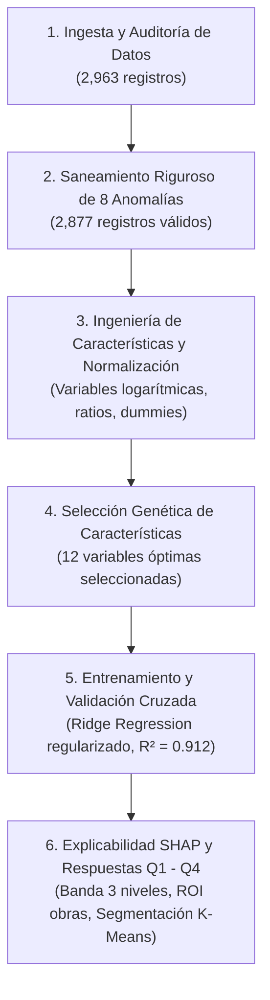

# Evaluación Técnica Data Scientist — Caso Clearview Properties
**Cuesta Partners · Take-home Assessment**  
**Candidato:** Daniel Alejandro Córdoba Pulido  
**Fecha:** Agosto 2026  

---

## 📌 1. Descripción del Proyecto

Este repositorio contiene la solución completa a la prueba técnica de Data Science para **Cuesta Partners**, desarrollada para la agencia inmobiliaria **Clearview Properties** en Cedar Falls, Iowa.

El objetivo central es transformar un histórico de **2,963 transacciones residenciales** en herramientas analíticas y comerciales concretas que respalden el criterio de los brókers, respondan a las 4 preguntas de negocio planteadas en el brief y maximicen el valor de las viviendas tasadas.

---

## 🗂️ 2. Estructura del Repositorio

```text
├── EDA_Test_cuesta.ipynb                              # Notebook principal con todo el flujo analítico de punta a punta
├── function_utils.py                                  # Módulo centralizado de funciones de ingeniería, modelado y visualización
├── Presentacion_Ejecutiva_Clearview_Properties_Cuesta.pptx # Presentación ejecutiva en PowerPoint (12 slides de negocio)
├── Brief_Candidate_DataScientist.pdf                  # Documento oficial del brief y requerimientos de la prueba
├── Data.csv                                           # Dataset histórico de transacciones (2,963 filas x 81 columnas)
├── Data_Dictionary.txt                                # Diccionario descriptivo de variables
├── data_cedar_falls.zip                               # Archivo comprimido con la data original y diccionario
├── assets_presentacion/                               # Gráficos en alta resolución embebidos en la presentación
│   ├── fig_q1_banda.png                              # Gráfico de estrategia de precios en 3 niveles
│   ├── fig_q2_drivers.png                            # Gráfico de descomposición Chasis (60%) vs Modificables (40%)
│   ├── fig_q3_matriz.png                             # Matriz de retorno vs costo de remodelaciones
│   ├── fig_q4_arbitraje.png                          # Gráficos de segmentación y ganancia por pavimentación
│   └── logo_cuesta.png                               # Logo institucional de Cuesta Partners
├── requirements.txt                                   # Lista de dependencias de Python para reproducibilidad exacta
├── .gitignore                                         # Exclusiones estándar para Git
└── README.md                                          # Documentación general y guía de ejecución
```

---

## ⚙️ 3. Requisitos y Guía de Reproducción

### Requisitos del Sistema
* **Python:** Versión 3.10, 3.11 o 3.12 recomendada.
* **Jupyter Lab / Notebook:** Para ejecutar el flujo interactivo.

### Paso a Paso para la Ejecución

1. **Clonar o descargar el repositorio:**
   ```bash
   git clone <URL_DEL_REPOSITORIO>
   cd prueba_cuesta_repo
   ```

2. **Crear y activar un entorno virtual (recomendado):**
   ```bash
   # En Windows
   python -m venv .venv
   .venv\Scripts\activate

   # En Linux / macOS
   python3 -m venv .venv
   source .venv/bin/activate
   ```

3. **Instalar dependencias:**
   ```bash
   pip install -r requirements.txt
   ```

4. **Lanzar Jupyter Lab y ejecutar el Notebook:**
   ```bash
   jupyter lab
   ```
   Abrir [`EDA_Test_cuesta.ipynb`](EDA_Test_cuesta.ipynb) y ejecutar todas las celdas secuencialmente (*Run All Cells*).

---

## 🔬 4. Arquitectura del Flujo Analítico (`EDA_Test_cuesta.ipynb`)

El notebook está diseñado bajo una arquitectura modular y estrictamente reproducible, con funciones centralizadas en [`function_utils.py`](function_utils.py):



### Principales Etapas Analíticas:
1. **Auditoría y Saneamiento de Calidad:**
   * Detección y corrección de 8 anomalías críticas no documentadas: corrección de precios centinela (`$9,999,999` y ceros redundantes), signos negativos, eliminación de duplicados, corrección de inconsistencias cronológicas de remodelación y tratamiento formal de nulos estructurales (garajes, sótanos).
2. **Selección Óptima de Variables:**
   * Algoritmo Genético multiobjetivo que reduce de más de 80 columnas a **12 variables clave de alto impacto**, optimizando $R^2$ sin incurrir en multicolinealidad.
3. **Modelado y Validación:**
   * Modelo lineal regularizado (**Ridge Regression**) sobre variables transformadas logarítmicamente.
   * **Métricas en conjunto de test (576 casas):** $R^2 = 0.912$, $	ext{MAPE} = 9.4\%$, $	ext{MAE} = \$16,500$.
4. **Explicabilidad de Negocio (SHAP):**
   * Descomposición de la formación de precio en variables de *Chasis Estructural* ($pprox 60\%$) y *Características Modificables* ($pprox 40\%$).

---

## 📊 5. Respuestas Ejecutivas a las Preguntas de Negocio

| Pregunta del Brief | Hallazgo Analítico Central | Estrategia de Negocio para Clearview |
| :--- | :--- | :--- |
| **Q1 · Rango de Listado** | Los residuos del modelo definen un intervalo proporcional empírico del **$80\%$ de cobertura real**: **$P_{10} = -13.6\%$** (Piso) y **$P_{90} = +16.3\%$** (Techo). | **Estrategia de 3 Niveles:** Proporcionar al bróker un Techo Optimista ($+16\%$), una Estimación Central de Mercado ($100\%$) y un Piso de Cierre Rápido ($-14\%$). |
| **Q2 · Drivers de Valor** | El **$60\%$** del valor lo determina el *Chasis Estructural* (`Overall Qual`, `Gr Liv Area`, `Total Bsmt SF`, `Year Built`, `Garage Cars`). El **$40\%$** restante depende de *Características Modificables*. | Concentrar el diálogo con el vendedor en las variables modificables que incrementan el valor de salida (baños, cocina, acabados). |
| **Q3 · ROI de Mejoras** | **Quick Wins de Alto Retorno:** Baño completo adicional ($+\$9,688$), pavimentación vehicular ($+\$5,273$), terminación interior de garaje ($+\$3,025$). | Recomendar prioritariamente obras de bajo costo y alto retorno. **Desaconsejar** construir chimeneas desde cero (costo de obra civil > ganancia de $+\$11,340$). |
| **Q4 · Segmentación y Oportunidad** | El análisis PCA + K-Means ($K=3$) identifica 3 segmentos: **Alto** ($\$237.6	ext{k}$), **Medio** ($\$136.9	ext{k}$) y **Entrada** ($\$112.5	ext{k}$). El **$0\%$** de las casas de Entrada tiene pavimento. | **Oportunidad de Reposicionamiento:** Invertir $pprox \$3,000$ en pavimentar la entrada en el segmento Entrada desbloquea un salto de **$+\$24,400$** al segmento Medio. |

---

## 📑 6. Entregables Oficiales

1. 💻 **Notebook Reproducible:** [`EDA_Test_cuesta.ipynb`](EDA_Test_cuesta.ipynb)
2. 📊 **Presentación Ejecutiva para el Cliente:** [`Presentacion_Ejecutiva_Clearview_Properties_Cuesta.pptx`](Presentacion_Ejecutiva_Clearview_Properties_Cuesta.pptx) *(12 diapositivas, formato 16:9, identidad visual de Cuesta Partners y citas a fuentes estándar de la industria [costvsvalue.com](https://www.costvsvalue.com) y [nahb.org](https://www.nahb.org))*.
